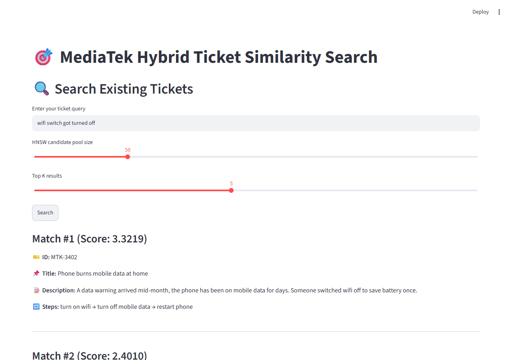
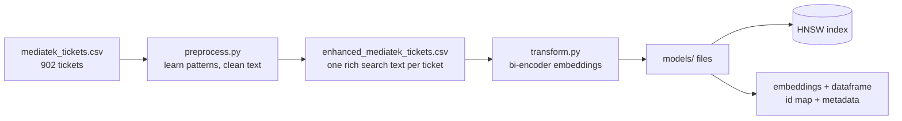
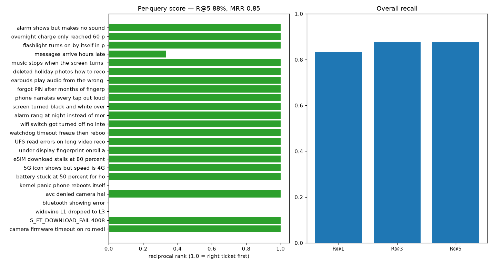
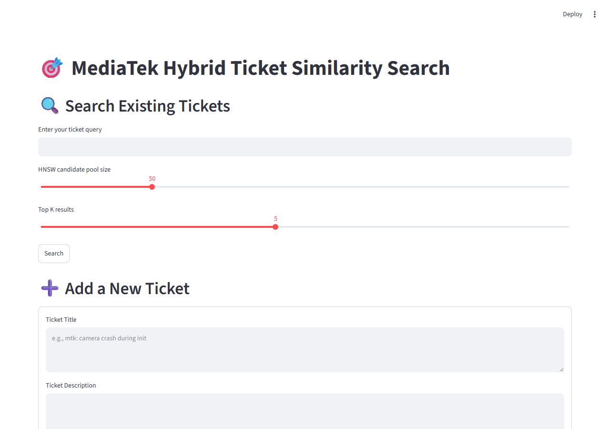

# Ticket Similarity AI System

Find past support tickets that match a new problem — by meaning, not keywords.
Built for MediaTek support data: 902 tickets covering modem failures, Android
platform quirks, and everyday user issues ("wifi got turned off").



**Scoreboard (24-query eval, measured — see [Evaluation](#evaluation)):**

| Metric | Score |
|---|---|
| Recall@1 | 0.83 |
| Recall@5 | 0.88 |
| MRR | 0.85 |
| Query latency (p50, CPU) | ~2.3 s |

## Features

- **Hybrid search** — fast embedding retrieval shortlists 50 candidates, an
  accurate cross-encoder reranks them. Speed *and* precision.
- **Ticket-aware cleaning** — an `AdaptiveMTKProcessor` learns platform ids
  (`ro.mediatek.platform`), chip names (`MT6896`), build tags (`ALPS.K2`),
  and error codes (`S_FT_DOWNLOAD_FAIL`, `0xC0050003`) from your data, then
  folds them into every ticket — and every query.
- **Rules-first keyword sorting** — common terms go through instant word
  lists; only unknown terms reach the heavy classifier. Measured: better
  accuracy at a fraction of the build cost.
- **Grows live** — new tickets added in the UI are embedded and indexed on
  the spot, no rebuild needed (index auto-expands).
- **CI-built index** — push tickets or code and GitHub Actions rebuilds
  everything and publishes a versioned Release.

## How it works

Two transformer models split the job:

- **Bi-encoder** (`all-mpnet-base-v2`) turns each text into one vector,
  independently. Comparing vectors is cheap, so it scans the whole corpus.
- **Cross-encoder** (`ms-marco-MiniLM-L-6-v2`) reads the query *together
  with* one candidate and scores the pair 0–1. Accurate, but too slow to
  run on all 902 tickets — so it only sees the shortlist.

### Build time (once per data change)



### Query time (every search)


## Project structure

| Path | What it is |
|---|---|
| `mediatek_tickets.csv` | Source data: 902 tickets (`ticket_id,title,description,repeat_steps`) |
| `preprocess.py` | Learns patterns, cleans text, writes the enhanced CSV |
| `transform.py` | Embeds tickets, builds the HNSW index + metadata |
| `app.py` | Streamlit UI: search + add tickets |
| `main.py` | Same search as a plain script |
| `eval_retrieval.py` | 24-query eval harness (recall, MRR, latency, chart) |
| `models/` | Built artifacts: index, embeddings, dataframe, id map, meta |
| `docs/` | Eval chart/results, app screenshots |
| `.github/workflows/build-index.yml` | CI: rebuild + publish a Release on every push |

## Setup

```bash
pip install -r requirements.txt
python -m spacy download en_core_web_sm
```

Python 3.11 recommended — `hnswlib` has no prebuilt install for 3.14.
(CI builds on 3.11.)

## Usage

```bash
# 1. Clean tickets and learn patterns (~10 min, downloads models once)
python preprocess.py --input mediatek_tickets.csv --output enhanced_mediatek_tickets.csv

# 2. Embed + index (~4 min)
python transform.py

# 3. Search in the browser
streamlit run app.py

# 4. Score the system against 24 known-good queries
python eval_retrieval.py
```

Skip pattern learning on rebuilds with `--skip-pattern-discovery`.
Tune index headroom with `transform.py --max-elements 5000`.

## Evaluation

`eval_retrieval.py` runs 24 queries — half technical (`S_FT_DOWNLOAD_FAIL
4008`, `avc denied camera hal`), half plain user words (`wifi switch got
turned off`, `phone narrates every tap`) — each with 1–2 tickets verified
to solve it. It runs the real pipeline (clean → embed → candidates →
rerank) and reports Recall@k, MRR, and latency. Candidates here come from
exact search over the same vectors, so numbers are an upper bound on the
approximate index.



| # | Query | Top hit | Hit? |
|---|---|---|---|
| 1 | camera firmware timeout on ro.mediatek.platform | MTK-2040 | ✅ |
| 2 | S_FT_DOWNLOAD_FAIL 4008 | MTK-3170 | ✅ |
| 3 | widevine L1 dropped to L3 | MTK-3314 | ❌ |
| 4 | bluetooth showing error | MTK-1086 | ❌ |
| 5 | avc denied camera hal | MTK-3120 | ✅ |
| 6 | kernel panic phone reboots itself | MTK-3132 | ❌ |
| 7 | battery stuck at 50 percent for hours | MTK-3380 | ✅ |
| 8 | 5G icon shows but speed is 4G | MTK-3310 | ✅ |
| 9 | eSIM download stalls at 80 percent | MTK-3150 | ✅ |
| 10 | under display fingerprint enroll always fails | MTK-3350 | ✅ |
| 11 | UFS read errors on long video record | MTK-3100 | ✅ |
| 12 | watchdog timeout freeze then reboot | MTK-3140 | ✅ |
| 13 | wifi switch got turned off no internet | MTK-3400 | ✅ |
| 14 | alarm rang at night instead of morning | MTK-3454 | ✅ |
| 15 | screen turned black and white overnight | MTK-3451 | ✅ |
| 16 | phone narrates every tap out loud | MTK-3487 | ✅ |
| 17 | forgot PIN after months of fingerprint | MTK-3616 | ✅ |
| 18 | earbuds play audio from the wrong phone | MTK-3433 | ✅ |
| 19 | deleted holiday photos how to recover | MTK-3535 | ✅ |
| 20 | music stops when the screen turns off | MTK-3565 | ✅ |
| 21 | messages arrive hours late | MTK-3324 | ✅ |
| 22 | flashlight turns on by itself in pocket | MTK-3518 | ✅ |
| 23 | overnight charge only reached 60 percent | MTK-3694 | ✅ |
| 24 | alarm shows but makes no sound | MTK-3457 | ✅ |

21/24 in the top 5; 20/24 at rank 1. The 3 misses are short vague queries
(`bluetooth showing error`) where a sibling ticket outranks the labeled
ones — broader candidates, not wrong answers. Latency is CPU-measured;
a GPU or smaller rerank pool brings it under a second.

## Screenshots

Home:



Results for *"wifi switch got turned off"* — top hit is the exact ticket:


## Adding tickets

Use the **Add a New Ticket** form in the app: the ticket is cleaned,
embedded, appended to the index (which expands itself), and saved to the
CSV — searchable immediately, no rebuild.

## Automation

`.github/workflows/build-index.yml` — every push touching tickets or
pipeline code rebuilds preprocessing + embeddings + index on CI and
publishes a versioned **Release** with all six artifact files. Download
them into `models/` (plus the CSV) and the app serves the fresh index.

## Limits & next steps

- Keyword buckets are sparse by design (classifier only keeps confident
  calls) — embeddings carry retrieval quality.
- Cross-encoder over 50 candidates sets CPU latency (~2 s); drop the pool
  to 20–30 or add a GPU for interactive speed.
- Next: persist learned patterns so fresh app instances clean queries
  with the full pattern set; eval split held out from development queries.
